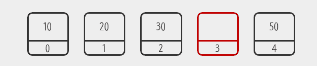
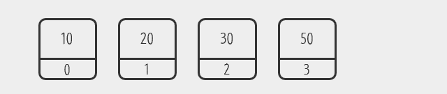
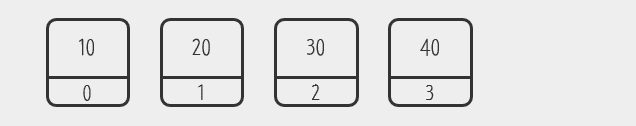
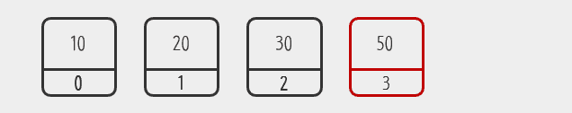
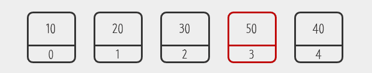
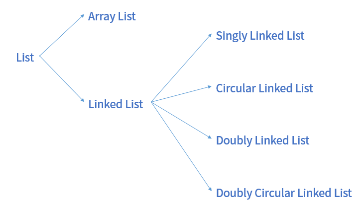

# Week 2 - 다양한 종류의 List

## List 자료구조

### List 란?

1. 기존 배열은 index를 통해 데이터를 저장하거나 조회
2. 기본 배열은 데이터가 삭제될 경우 해당 인덱스를 빈 공간으로 남겨두기 때문에 메모리 낭비를 초래
3. 이러한 단점을 극복한 자료구조가 List
4. List는 빈틈없이 데이터를 적재함

데이터 삭제의 경우

배열에서 4번째 데이터 삭제

리스트에서 4번째 데이터 삭제

데이터 추가의 경우

해당 구조에서

배열에서 4번째에 데이터 추가시 해당 인덱스의 데이터를 대체함

리스트에서 4번째에 데이터 추가시 기존 데이터를 유지함

### List의 종류


* List
  * Array List
  * Linked List
    * 단방향 Linked List
    * 단방향 원형 Linked List
    * 양방향 Linked List
    * 양방향 원형 Linked List
  
### List의 기능

1. 처음, 끝, 중간에 데이터를 추가/삭제
2. 리스트에 데이터가 있는지 확인
3. 리스트에 저장되어 있는 데이터에 접근

### Java 에서의 사용

```
import java.util.ArrayList;
import java.util.LinkedList;

LinkedList<> list = new LinkedList<>();
ArrayList<> list = new ArrayList<>();
//Vector를 통해 해당 List의 자료형 지정 가능
```

## ArrayList

### 개념적 정의

1. 배열에서 발전된 상태의 리스트
2. 인덱스가 비어있지 않은 상태를 유지함
3. 인덱스가 가득 차면 자동으로 크기를 증가시킴

### 기능적 구성

1. 