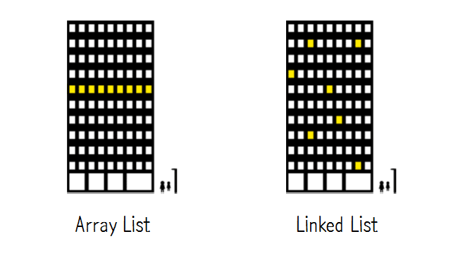
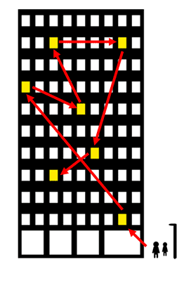

# Week 2 - 다양한 종류의 List

## List 자료구조

### List 란?

1. 기존 배열은 index를 통해 데이터를 저장하거나 조회
2. 기본 배열은 데이터가 삭제될 경우 해당 인덱스를 빈 공간으로 남겨두기 때문에 메모리 낭비를 초래
3. 이러한 단점을 극복한 자료구조가 List
4. List는 빈틈없이 데이터를 적재함

데이터 삭제의 경우


배열에서 4번째 데이터 삭제


리스트에서 4번째 데이터 삭제

데이터 추가의 경우


해당 구조에서


배열에서 4번째에 데이터 추가시 해당 인덱스의 데이터를 대체함


리스트에서 4번째에 데이터 추가시 기존 데이터를 유지함

### List의 종류


- List

  - Array List
  - Linked List
    - 단방향 Linked List
    - 단방향 원형 Linked List
    - 양방향 Linked List
    - 양방향 원형 Linked List

### List의 기능

1. 처음, 끝, 중간에 데이터를 추가/삭제
2. 리스트에 데이터가 있는지 확인
3. 리스트에 저장되어 있는 데이터에 접근

### Java 에서의 사용

```
import java.util.ArrayList;
import java.util.LinkedList;

LinkedList<> list = new LinkedList<>();
ArrayList<> list = new ArrayList<>();
//제네릭을 통해 해당 List의 자료형 지정 가능
```

## ArrayList

### 개념적 정의

1. 배열에서 발전된 상태의 리스트
2. 인덱스가 비어있지 않은 상태를 유지함
3. 인덱스가 가득 차면 자동으로 크기를 증가시킴

### Operations

```
void Init(ArrayList *plist);
- 초기화할 리스트의 주소 값을 인자로 전달한다

void Insert(ArrayList *plist, Data data);
- 리스트에 데이터를 저장한다

int First(ArrayList *plist, Data *pdata);
- 첫 번째 데이터를 pdata가 가리키는 메모리에 저장한다
- 참조 성공시 1, 실패시 0을 반환한다

int Next(ArrayList *plist, Data *pdata);
- 참조된 데이터의 다음 데이터를 pdata가 가리키는 메모리에 저장한다
- 순차적인 참조를 위해서 반복 호출이 가능하다
- 참조를 새로 시작하려면 먼저 First 함수를 호출한다
- 참조 성공시 1, 실패시 0을 반환한다

Data Remove(ArrayList *plist);
- First 또는 Next 함수의 마지막 반환 데이터를 삭제한다
- 삭제된 데이터는 반환된다
- 마지막 반환 데이터를 삭제하므로 연속적인 반복 호출은 금지한다

int Count(ArrayList *plist);
- 리스트에 저장되어 있는 데이터의 수를 반환한다
```

## LinkedList

### 개념적 정의

1. ArrayList와는 다르게 데이터와 데이터 간의 연결(Link)을 이용하여 리스트를 구현한 것
2. 메모리상 이어저있는 ArrayList와 비교했을 때 LinkedList는 구조적으로 자유롭다




3. 각 데이터들은 Node라고 부른다
4. 각각의 노드들은 value와 다른 노드를 가르킬 next 포인터를 갖는다


5. LinkedList는 기본적으로 Head 노드와 Tail 노드를 갖는다

### Operations

```
Node* CreateNode(Data data);
- 노드를 생성한다

void DeleteNode(Node *node);
- 노드를 삭제한다

void InsertLast(Node **head, Node *newNode);
- Tail 부분에 새로운 노드를 추가한다

Node* getNode(Node *head, int index);
- index에 위치한 노드를 찾는다

void RemoveNode(Node **head, Node *removeNode);
- 삭제하고자 하는 노드를 찾아 삭제한다

void InsertAfter(Node *current, Node *newNode);
- 지정된 노드 이후에 새로운 노드를 추가한다
```

## 숙제

1. ArrayList가 가득 찼을 경우 배열의 크기를 증가시키는 방법을 고민하고 수정해보세요
2. 단방향 LinkedList를 수정하여 양방향 LinkedList로 구현해보세요

### 참고 사이트

[양방향 Linked List](https://opentutorials.org/module/1335/8940)

[Java로 구현한 양방향 Linked List](https://opentutorials.org/module/1335/8941)

[C로 구현한 양방향 Linked List](https://macinjune.com/all-posts/web-developing/mac-develop-tip/c-doubly-linked-list-%EA%B5%AC%ED%98%84/)