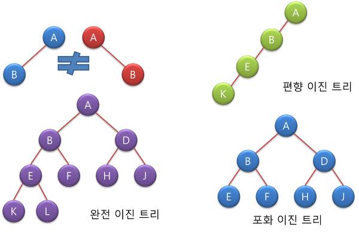

# Week 3 - Tree

## Tree

### Tree란?

1. 비선형 자료구조
2. 계층적 관계를 표현하는 자료구조
3. 데이터의 저장, 검색, 삭제의 관점이 아닌 데이터의 표현의 관점에서 바라봐야 함

### Tree와 관련된 용어


- Root Node : 부모 노드가 없는 노드. 트리는 하나의 루트 노드를 가짐
- Leaf Node : 자식 노드가 없는 노드
- Internal Node : Leaf Node 가 아닌 노드
- Edge : 노드를 연결하는 선(Link, Branch)
- Sibling : 같은 부모 노드를 가지는 노드
- Size : 자신을 포함한 모든 자손 노드의 개수
- Depth : 루트 노드에서 어떤 노드에 도달하기 위해 거쳐야 하는 Edge의 수
- Level : 트리의 특정 깊이를 가지는 노드의 집합
- Degree : 하위 트리의 개수 혹은 Edge 수
- Height : 루트 노드에서 가장 깊숙히 있는 노드의 깊이

### Tree의 특징

- 트리는 계층 모델이다
- 노드가 N개인 트리는 항상 N-1의 Edge를 가진다
- 루트에서 어떤 노드로 가는 경로는 유일하다
- 한 개의 루트 노드만이 존재하며, 모든 자식 노드는 한 개의 부모 노드만을 가진다

### Tree의 종류

- 이진 트리
- 이진 탐색 트리
- 균형 트리
  - AVL 트리
  - Red-Black 트리
- 이진 힙

### Tree의 구현

1. 노드를 생성, 삭제하고 노드에 저장된 데이터를 조회하는 구조체를 만든다
2. 각 구조체는 부모, 자식 노드의 주소를 저장할 수 있다
3. 부모 혹은 자식이 존재하지 않을 경우 NULL값을 저장한다

### Operations

```
Node* newNode(Data data);
- 노드를 생성하는 생성자

Tree* newTree();
- 트리를 생성하는 생성자

void NodeChangeData(Node *node, Data data);
- 노드에 저장된 데이터를 갱신하는 함수

void InsertChild(Node *node, Data data);
- 노드에 자식 노드를 추가하는 함수

void deleteAllChild(Node *node);
- 노드의 서브트리를 모두 삭제하는 함수

void deleteChild(Node *node, Data data);
- 노드의 자식 하나를 삭제하는 함수
```

## 이진 트리(Binary Tree)

### 이진 트리란

- 각 노드가 최대 두 개의 자식을 갖는 트리
- 루트 노드를 중심으로 두 개의 서브 트리로 나뉘어진다
- 나뉘어진 두 서브 트리도 모두 이진 트리여야 한다

### 포화 이진 트리와 완전 이진 트리



- 포화 이진 트리는 최고 레벨의 모든 노드가 가득 찬 상태를 말한다
- 완전 이진 트리는 노드가 왼쪽에서 오른쪽, 위에서 아래로 순서대로 노드가 채워진 상태를 말한다

### 트리의 순회

- 중위 순회(in-order traversal) : 왼쪽 가지 -> 현재 노드 -> 오른쪽 가지
- 전위 순회(pre-order traversal) : 현재 노드 -> 왼쪽 가지 -> 오른쪽 가지
- 후위 순회(post-order traversal) : 왼쪽 가지 -> 오른쪽 가지 -> 현재 노드

```
void inOrderTraversal(Node *node) {
  if(node != null) {
   inOrderTraversal(node->left);
   visit(node); //이 부분에 어떠한 연산 or 동작이 구현됨
   inOrderTraversal(node->right);
  }
}

void preOrderTraversal(Node *node) {
  if(node != null) {
   visit(node); //이 부분에 어떠한 연산 or 동작이 구현됨
   preOrderTraversal(node->left);
   preOrderTraversal(node->right);
  }
}

void postOrderTraversal(Node *node) {
  if(node != null) {
   postOrderTraversal(node->left);
   postOrderTraversal(node->right);
   visit(node);  //이 부분에 어떠한 연산 or 동작이 구현됨
  }
}

```

### 이진 트리의 구현

1. 방법은 일반 트리의 구현과 유사하다
2. 각 노드는 부모, 왼쪽 자식, 오른쪽 자식 노드의 주소를 저장할 수 있다

### Operations

```
Node* createNode(Data data);
- 노드를 생성하는 생성자

Data getData(Node *node);
- 노드에 저장되어 있는 데이터를 반환하는 함수

void setData(Node *node, Data data);
- 노드에 데이터를 저장하는 함수

Node* getLeftChild(Node *node);
- 왼쪽 자식 노드의 주소를 반환하는 함수

Node* getRightChild(Node *node);
- 오른쪽 자식 노드의 주소를 반환하는 함수

void setLeftChild(Node *node, Node *left);
- 왼쪽 자식 노드를 설정하는 함수

void setRightChild(Node *Node, Node *right);
- 오른쪽 자식 노드를 설정하는 함수

```

## 공지사항

1. 이번주 숙제는 없습니다.
2. 지난 수업들의 숙제를 마저 하시고 슬랙에 제출하면 됩니다.
3. 자료구조 공부는 일회성이 아닌 꾸준히 하는것이 중요합니다. 이 점 유의해서 스터디에 참여해 주세요.
4. 참고 링크에 있는 수식트리 관련 자료는 한번쯤 읽어보고 이해하는 것을 추천합니다.

## 참고 링크

[트리에 대한 설명-삼성소프트웨어멤버십](https://secmem.tistory.com/204)

[트리로 구현한 계산기-수식트리](https://gurumee92.tistory.com/131)
