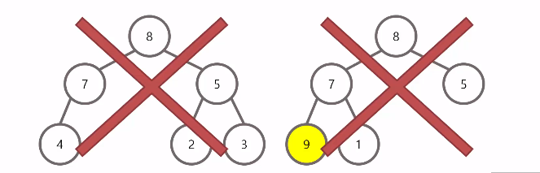

# Week 4 - 우선순위 큐 & 힙 (Priority Queue & Heap)

## 우선순위 큐

### 우선순위 큐 란?

1. 기본적인 기능(삽입, 삭제, 조회)는 큐와 비슷하다
2. 각각의 데이터들은 **우선순위**를 가진다
3. 데이터를 꺼낼 때 우선순위가 **높은** 데이터가 먼저 나온다는 특징이 있다
4. 운영체제의 작업 스케쥴링, 정렬, 네트워크 관리 등의 다양한 기술에 적용되고 있다
5. 일반적으로 우선순위 큐는 힙을 이용하여 구현하기 때문에 트리 구조로 보는 것이 합리적이다

### 최대 힙 (Max Heap)

1. 부모 노드가 자식 노드보다 값이 큰 완전 이진트리이다
2. 최대 힙의 Root 노드는 항상 최대값을 가진다

### 최소 힙 (Min Heap)

1. 부모 노드가 자식 노드보다 값이 작은 완전 이진트리이다
2. 최소 힙의 Root 노드는 항상 최소값을 가진다



부모 노드보다 자식 노드의 값이 더 크기 때문에 최대 힙이 아니다


최대 힙의 조건을 만족한다

### 우선순위 큐의 삽입

1. 삽입할 데이터를 완전 이진트리를 유지하는 형태로 순차적으로 삽입된다
2. 삽입 이후에는 루트 노드까지 거슬러 올라가며 힙을 구성한다(부모 노드와 비교해 부모 노드가 우선순위가 낮으면 교체한다)


### 우선순위 큐의 삭제

1. 루트노드를 삭제한다
2. 가장 마지막 노드를 루트 노드의 위치로 옮겨준다
3. 루트 노드로부터 아래로 내려가면서 힙을 구성한다


## 최소 힙을 통한 우선순위 큐 구현

### 배열 기반 트리

1. 배열의 Index를 통해 트리를 구성 할 수 있다
2. 0번 Index는 비워둔다
3. 1번 Index는 항상 Root 노드이다
4. 왼쪽 자식의 Index는 (부모 Index) * 2 이며 오른쪽 자식 Index는 (부모 Index) * 2 + 1 이다
5. 부모의 Index는 (자신의 Index) / 2 이다


### Operations

```
void PQueueInit(PQueue *ppq);
- 우선순위 큐의 초기화를 진행한다
- 우선순위 큐 생성 후 제일 먼저 호출되어야 하는 함수이다

int PQIsEmpty(PQueue *ppq);
- 우선순위 큐가 비어있는 경우 True(1), 아닐 경우 False(0) 을 반환하는 함수이다

void PEnqueue(PQueue *ppq, PQData data, Priority pr);
- 우선순위 큐에 데이터를 삽입한다

PQData PDequeue(PQueue *ppq);
- 우선순위가 가장 높은 데이터를 삭제한다
- 삭제된 데이터는 반환한다
- 본 함수가 호출되기 위해서는 데이터가 하나 이상 존재해야 한다
```

